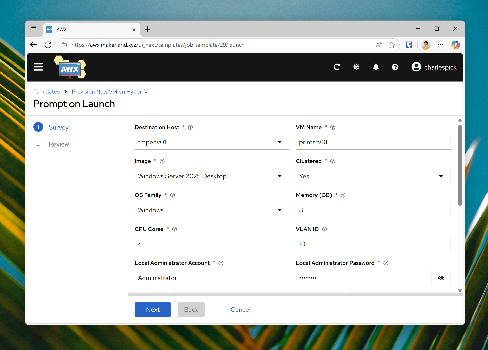

# Home Lab Virtual Machine Manager
Provision Virtual Machines on Hyper-V Infrastructure from Ansible or your favorite
automation system. 

**Advantages of using HLVMM**

* You don't need an SCVMM License or SQL Server instance.
* Tighter integration with modern automation tools - Ansible, NetBox, just to
name a few.
* Not another thing to maintain in your environment, developed for homelabbing,
just as powerful in the enterprise.
* Lightweight - all provisioning occurs on the hosts. Combine with AWX/Ansible
Tower or another automation system for centralized management.
* Secrets in provisioning artifacts are not exposed outside the VM. Instead of
mounting a specialized provisioning ISO with domain join and local administrator
passwords, HLVMM submits provisioning data to the virtual machine using Hyper-V's 
KVP integration, encrypted with a key only the VM has access to after the
provisioning process has finished. 

**How does it work?**

1. Host copies image and provisioning media, configures and starts VM
2. Guest initiates secure communication and gets it's data
3. Once host sends it's data, it's done
4. Guest finishes everything internally, doesn't need to signal anything to
the host with a shut down

**How do I get started?**

1. Build a golden image.
    
    Windows: `sysprep` your installation after you have installed everything you
    want. Activate Windows with AVMA if you're licensed for it, or extend the
    provisioning service to do this for you.
    
    Linux: Make sure cloud-init is ready and configured for "nocloud" (ISO/CD-ROM)
    provisioning. Make sure KVP Daemons are installed if not included with your
    distro by default. 
2. Bake the generic provisioning ISOs - refer to /Scripts
3. Publish the golden images and ISOs - further docs later, refer to the code
for exact paths for now
4. Hook up Ansible or another automation platform/front end. Or call the scripts
directly. 

**How can I extend the capabilities of the customization phase?**

While I'm actively developing properties and fields you can customize VMs with,
if you have a custom need, you can easily extend the functionality of the project
to fit your unique needs. 
1. Extend ProvisioningService.sh/ps1 with added params and logic
2. Add additional phases if you need additional reboots
3. Extend your calling hooks (Ansible playbooks or other scripts to use the 
new fields)
